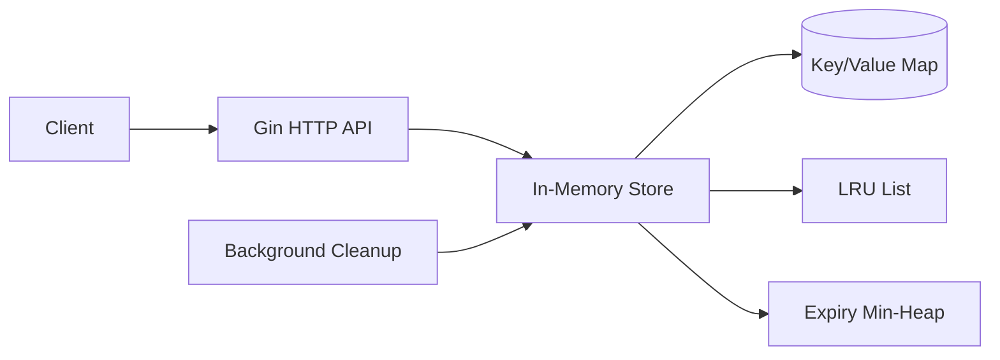
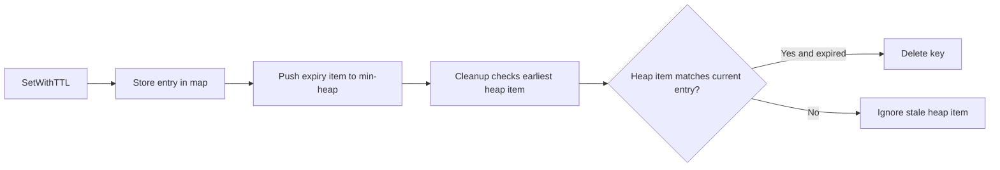

# KV Store


An in-memory key-value store built in Go. It supports string keys, string values, optional TTL expiration, background cleanup, and LRU eviction when a maximum capacity is configured.

## Architecture



## Project Structure

```text
KV Store/
|-- cmd/
|   `-- server/
|       `-- main.go
|-- internal/
|   |-- config/
|   |   `-- config.go
|   |-- handler/
|   |   |-- handler.go
|   |   `-- handler_test.go
|   |-- model/
|   |   `-- model.go
|   `-- store/
|       |-- store.go
|       `-- store_test.go
|-- .env.example
|-- .gitignore
|-- go.mod
|-- go.sum
|-- LICENSE
`-- README.md
```

## Components

### Store

Responsible for:

* GET, SET, SETNX, DELETE, EXISTS, and INCREMENT operations with optional TTL on SET
* Optional TTL per key
* Expired-key checks during reads
* Expiry tracking with a min-heap
* Background TTL cleanup
* LRU eviction when capacity is exceeded
* Thread-safe access with a mutex

### HTTP API

Responsible for:

* Routing requests with Gin
* Parsing JSON request bodies
* Parsing TTL durations
* Translating store results into HTTP status codes

---

## Tech Stack

### Backend

* Go
* Gin

### Data Structures

* Hash map
* Doubly linked list
* Min-heap

### Concurrency

* sync.Mutex
* Background goroutine
* Race-detector-tested store paths

---

## Features

* In-memory string key-value storage
* Optional TTL support
* Lazy expiration on GET and EXISTS
* Background expiration cleanup
* Stale heap entries for simpler TTL updates
* Configurable store capacity
* LRU eviction
* Atomic integer increment operation
* Conditional set-if-not-exists operation
* JSON HTTP API
* Concurrent store stress tests

---

## Expiration Flow



Expired keys are also checked during `GET` and `EXISTS`, so an expired value is not returned even if the background cleanup loop has not run yet.

---

## LRU Eviction

The store uses:

* a map for O(1) key lookup
* a doubly linked list for recency ordering
* a list node pointer on each entry for O(1) movement/removal

When capacity is exceeded, the least recently used key is removed from the back of the list.

---

## Getting started

### 1. Prerequisites

- Go 1.26+

### 2. Configure environment variables

Create a `.env` file:

```env
PORT=8080
STORE_CAPACITY=1000
CLEANUP_INTERVAL=1s
```

`STORE_CAPACITY <= 0` means unlimited capacity.

### 3. Run the server

```bash
go run ./cmd/server
```

The API will listen on:

```text
http://localhost:8080
```

---

## Endpoints

### Set Key

```http
PUT /kv/:key
```

Without TTL:

```json
{
  "value": "hello"
}
```

With TTL:

```json
{
  "value": "hello",
  "ttl": "10s"
}
```

### Get Key

```http
GET /kv/:key
```

Success:

```json
{
  "key": "name",
  "value": "eren"
}
```

Missing or expired keys return `404`.

### Exists

```http
GET /kv/:key/exists
```

Response:

```json
{
  "key": "name",
  "exists": true
}
```

### Increment Key

```http
POST /kv/:key/increment
```

Missing or expired keys are created with value `"1"`.

Success:

```json
{
  "key": "counter",
  "value": "2"
}
```

Non-integer values and integer overflow return `409 Conflict`.

### Set If Not Exists

```http
POST /kv/:key/setnx
```

Request:

```json
{
  "value": "hello"
}
```

Success:

```json
{
  "key": "name",
  "value": "hello"
}
```

Existing live keys return `409 Conflict` and are not overwritten.

### Delete Key

```http
DELETE /kv/:key
```

Successful deletes return `204 No Content`.

Missing keys return `404`.

---

## Testing

Run all tests:

```bash
go test ./...
```

Run store stress tests repeatedly:

```bash
go test -count=100 -run Concurrent ./internal/store
```

Run race-detector tests:

```bash
go test -race ./...
```

On Windows, `go test -race` requires CGO and a C compiler such as GCC.

---

## Known Limitations

* Data is stored only in memory and is lost when the process exits
* No authentication, authorization, or rate limiting is implemented
* The store uses a single mutex, so all operations are serialized
* Expiry heap entries can become stale and remain until cleanup reaches them
* Background cleanup runs on a fixed interval instead of sleeping until the next expiry
* There is no graceful HTTP shutdown yet
* Values must be non-empty strings through the HTTP API
* Increment only supports signed 64-bit integer strings
* SETNX does not currently support TTL
* The HTTP API does not expose remaining TTL metadata

---

## Future Improvements

* Handler and store benchmarks
* Persistence / snapshots
* Additional atomic operations
* Metrics endpoint
* Graceful HTTP shutdown
* Sharding
* Configurable response formats
* Docker support

---

## License

This project is licensed under the MIT License. See [LICENSE](LICENSE).
